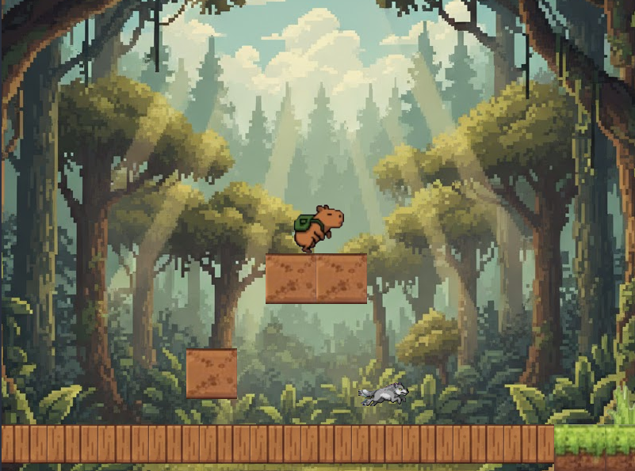
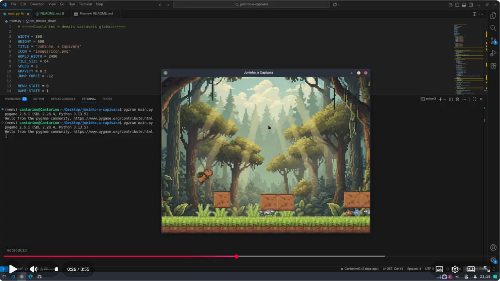

# Juninho, a Capivara 🐾
Um jogo de plataforma em Python usando Pygame Zero, onde você controla Juninho, uma capivara aventureira em busca da bandeira final enquanto evita inimigos saltitantes e perigosos!

**Jogo desenvolvido para o teste técnico de tutor da Kodland.**

## 🎮 Sobre o Jogo

"Juninho, a Capivara" é um jogo 2D de plataforma com:

- Personagem jogável com animações (parado, andando, pulando)
- Inimigos com patrulha e movimentações diferentes (incluindo inimigos saltadores)
- Sistema de câmera lateral estilo side-scroll
- Mapa construído com tiles sólidos e decorativos
- Estados de jogo: Menu, Jogo, Vitória, Derrota
- Botões interativos com detecção de hover e som
- Controle de som (ativar/desativar música e efeitos)
- Colisões de solo e física simples (gravidade e pulo)

## 🕹️ Como Jogar

| Tecla | Ação |
|-------|-------|
| ← | Andar para a esquerda |
| → | Andar para a direita |
| Espaço | Pular |
| Mouse | Navegar no menu e clicar nos botões |

Objetivo:
Chegue até a bandeira no final do mapa sem encostar nos inimigos.

## ▶️ Como Executar

### 1. Instale o Pygame Zero

```pip install pgzero```


### 2. Rode o jogo

```pgzrun main.py```

## Demonstação em Vídeo

[]([url_do_site](https://www.youtube.com/watch?v=Td3tJkrHF_o))